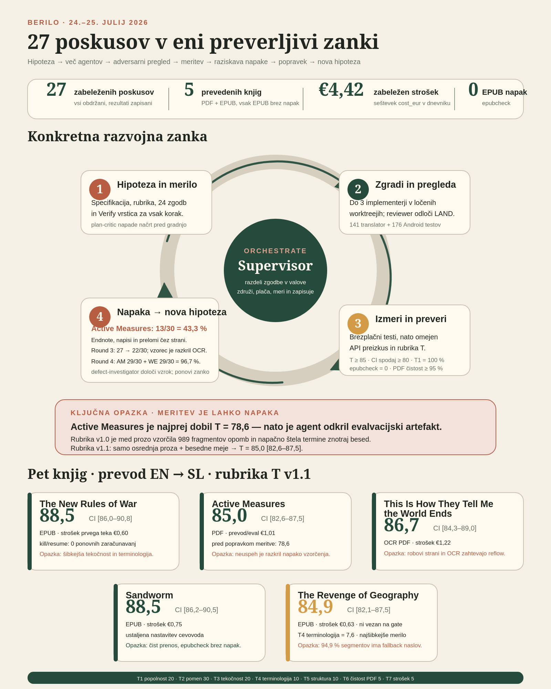

# Berilo

**Read books in your own language.**

🇸🇮 **Slovensko:** [README.sl.md](README.sl.md) — celotna navodila v slovenščini.

<p align="center">
  
</p>

Berilo translates books (PDF / EPUB / MOBI) into your language using inexpensive
LLMs — built to preserve meaning, not just words — and gives you a reading app
made for people who actually read: an in-context LLM dictionary, interpretation
of dense paragraphs, highlights and notes.

Five books have gone through the pipeline end to end, English → Slovenian, at
€0.60–€1.45 each. Translation quality is scored, not asserted: 85.0–88.5 on a
100-point rubric with bootstrap confidence intervals.

## Is it free?

**Yes.** Berilo is MIT-licensed software. There is no account, no subscription,
no Berilo server, and no telemetry. The Android app requests exactly one
permission — `INTERNET` — and uses it only to reach the LLM provider you
configured.

You pay one party, and it is not us: **your own LLM provider**, per token, at
their list price. A full book costs roughly €1. See
[What it costs](#what-it-costs).

### Your API key stays with you

| Where | Storage | Leaves the device? |
|-------|---------|--------------------|
| Translator CLI | `.env` in the project folder (gitignored) | Never — only to the provider's API |
| Android app | `EncryptedSharedPreferences`, `allowBackup=false` | Never — only to the provider's API |

Concretely:

- The key goes from your `.env` / your phone straight to `api.openai.com` or
  `api.anthropic.com`. There is no middleman, because there is no Berilo backend.
- **Your books never leave your machine.** Only the text segments being
  translated are sent to the provider — the same as pasting a paragraph into a
  chat window, one batch at a time.
- Keys are never logged. In the CLI, `Config` marks the key fields `repr=False`,
  so they are omitted from anything that prints or logs the config. In the app,
  tests assert that an auth failure's error message *and* its cause contain no
  key material.
- Set a spend cap in your provider's dashboard if you want a hard ceiling. Berilo
  also refuses to start a paid run without showing you the estimate first.

### Getting a key

**OpenAI** (default, cheapest for this job) — <https://platform.openai.com/api-keys>
→ *Create new secret key* → top up a few euros of credit → paste into `.env` as
`OPENAI_API_KEY`.

**Anthropic** (alternative) — <https://console.anthropic.com/settings/keys>
→ *Create Key* → paste into `.env` as `ANTHROPIC_API_KEY`.

One provider is enough. Default model is `gpt-5-mini`; every model is
user-selectable with `--model`.

## What it costs

Measured full-book runs, English → Slovenian, `gpt-5-mini`, reasoning effort
`low`. Rubric T is the translation-quality score (0–100) with a 95 % bootstrap CI.

| Book | Source | Words | Style | Cost | Rubric T |
|------|--------|-------|-------|------|----------|
| The New Rules of War | EPUB | 82 k | `baseline_v1` | €0.60 | 88.5 [86.0, 90.8] |
| Sandworm | EPUB | 105 k | `baseline_v1` | €0.75 | 88.5 [86.2, 90.5] |
| The Revenge of Geography | EPUB | 124 k | `revise_v1` (default) | €1.45 | 88.0 [86.2, 89.9] |
| Active Measures | PDF | 144 k | `baseline_v1` | €1.01 | 85.0 [82.6, 87.5] |
| This Is How They Tell Me the World Ends | scanned PDF (OCR) | 182 k | `baseline_v1` | €1.22 | 86.7 [84.3, 89.0] |

Normalized, at ~300 words per printed page:

| | per 100 pages (~30 k words) | per 100 k words | typical 350-page book |
|---|---|---|---|
| **`revise_v1`** — default, adds a native-editor second pass | **≈ €0.35** | ≈ €1.17 | **≈ €1.20** |
| `baseline_v1` — single pass, `--style baseline_v1` | ≈ €0.20 | ≈ €0.70 | ≈ €0.75 |

The default costs about 1.7× the single pass and buys a measured +4.1 points of
Rubric T on a full book (83.9 → 88.0, near-disjoint CIs). Cheap either way.

Other spend:

- `berilo translate --dry-run` — **€0.00.** Prints the per-chapter token estimate
  and total before anything is billed.
- `berilo doctor` — one sentence, ~€0.0001.
- `berilo eval --sample 40` — ~€0.15 per scoring run.
- **Re-runs are free.** Every translated segment is cached, keyed by book,
  segment, model, language *and* prompt version. Interrupt a run and restart it:
  you pay only for what wasn't done.

Prices as of 2026-07 (`translator/berilo/providers/pricing.py`, USD→EUR 0.92).
Verify against your provider's current rates before relying on absolute figures.

## Status

| Phase | What | Status |
|-------|------|--------|
| 1 | Translator CLI (`translator/`) — book in, translated EPUB out | working; 5 books shipped, Rubric T ≥ 85 on all |
| 2 | Android reader (`android/`) — offline, e-ink friendly (Boox) | code complete, 180 tests green; on-device verification pending |
| 3 | Cloud sync + web note review (closed-source service) | planned |

Plan and objective acceptance criteria: [`docs/project_plan.md`](docs/project_plan.md).
Quality rubrics the project optimizes: [`docs/rubric.md`](docs/rubric.md).

## Translator CLI (Phase 1)

```bash
cp .env.example .env             # add your OpenAI or Anthropic key
cd translator && pip install -e .

berilo doctor                    # provider smoke test, one sentence, ~€0
berilo inspect mybook.epub       # extraction preview, no API cost
berilo translate mybook.epub --to sl --dry-run   # cost estimate — always run first
berilo translate mybook.epub --to sl             # translated EPUB alongside the source
berilo eval mybook.sl.epub --sample 40 --seed 42 # quality score with a CI (~€0.15)
```

Useful flags:

| Flag | Effect |
|------|--------|
| `--to sl` | Target language (default from `.env`, `sl`) |
| `--dry-run` | Estimate cost, make zero API calls |
| `--style baseline_v1` | Single-pass, ~40 % cheaper, measurably less fluent |
| `--model gpt-5` | Any model in the pricing table |
| `--bilingual` | Emit a source + target EPUB |
| `--skip-back-matter` | Pass index/notes/bibliography through untranslated |
| `-o out.epub` | Output path |

Requires Python 3.10+. MOBI input additionally requires Calibre (`ebook-convert`).

## Reader app (Phase 2, Android / Boox)

An offline EPUB reader (Readium-based) with an LLM dictionary, paragraph
interpretation, highlights and notes. It reads whatever the translator CLI
produced — no cloud dependency.

Built for e-ink first: no animations, full-refresh page turns, pure black-on-white
theme, ≥ 48 dp touch targets, WCAG AA contrast.

**Build from source** (until the v0.1 release is published):

```bash
cd android
./gradlew assembleRelease
adb install -r app/build/outputs/apk/release/app-release.apk
```

**Install a release APK** on a Boox, once
[Releases](https://github.com/nikogamulin/berilo/releases) has one: enable
**Settings → Apps → Special app access → Install unknown apps** for your browser
or file manager, then open the downloaded APK on-device.

## How it was built

Berilo was built by a supervised multi-agent loop — one hypothesis at a time,
each measured against a rubric before it was allowed to stay. Over 100 commits,
32 recorded iterations, €6.68 of API spend, two days.

The full method — agent roles, the measurement loop, and the four things that
went wrong and what they taught — is written up here:

📄 **[How Berilo was built with agents](docs/how_it_was_built.md)** ·
🇸🇮 [v slovenščini](docs/how_it_was_built.sl.md)

<p align="center">
  
</p>

## Development

```bash
# Translator — 239 tests
cd translator && pip install -e ".[dev]"
make test && make lint

# Android — 180 tests
cd android
./gradlew assembleDebug test lintDebug   # everyday dev loop
./gradlew assembleRelease                # minified release build (debug-signed
                                          # unless android/keystore.properties exists —
                                          # see keystore.properties.example)
```

## Principles

- Your books and your keys stay on your machine. Only text segments are sent to
  the LLM provider you configure.
- Translation quality is measured, not assumed — see the scoring harness in
  [`docs/rubric.md`](docs/rubric.md).
- Costs are visible before they are spent. No paid run starts without an estimate.
- Cheapest model that does the job is the default; every model is user-selectable.
- No piracy features. You supply files you own.

## License

MIT — Niko Gamulin, PhD. (Phases 1–2 are open source; the optional cloud sync
service is a separate closed-source product.)
