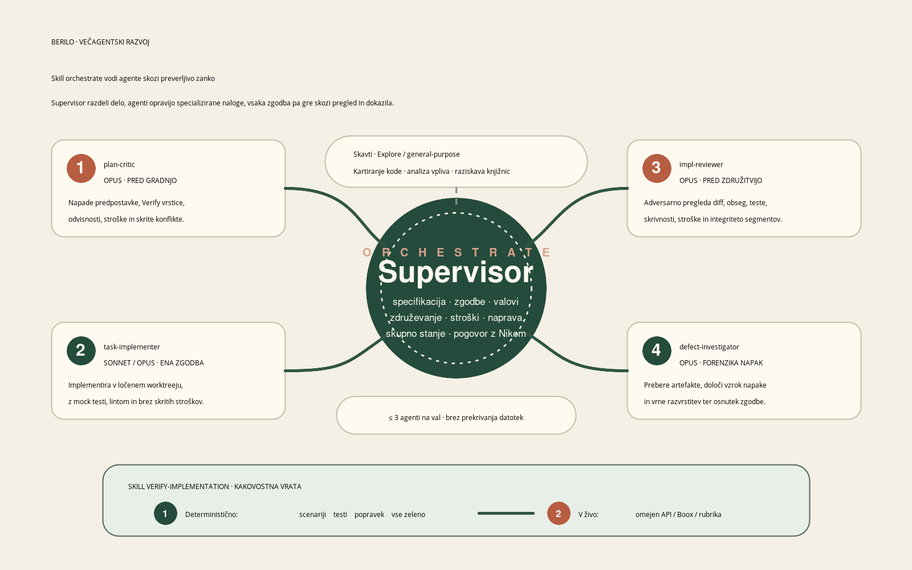

# How Berilo was built with agents

🇸🇮 **Slovensko:** [how_it_was_built.sl.md](how_it_was_built.sl.md)

Berilo is a translator CLI, an Android reader, and a measurement harness — over
100 commits, 419 tests, 5 books translated, in two days, for €6.68 of API spend.
Almost none of it was typed by hand. It was built by a supervised multi-agent
loop running inside [Claude Code](https://claude.com/claude-code).

This document is the method, not a demo. Every claim below has an artifact
behind it in this repository.

---

## 1. The problem the process had to solve

Agents write plausible code fast. Plausible is the problem. A translation
pipeline fails silently: the EPUB assembles, the tests pass, the output is fluent
— and the meaning is wrong, or a chapter is missing, or the "improvement" you
just A/B tested was served from a cache and never called the model at all.

So the process was designed around one rule: **nothing counts until it is
measured against a number that existed before the work started.**

That number is a rubric. [`docs/rubric.md`](rubric.md) defines T (translation
quality), R (reader experience), S (sync), D (process health), each with a
scoring procedure, weights, and a gate. Rubric T is scored by sampling 40
source/target pairs at a fixed seed, judging them with an LLM, and
bootstrapping a 95 % confidence interval. It is not a vibe check; it is
reproducible and it costs about €0.15 to run.

## 2. The shape: one Supervisor, five specialized agents

<p align="center">
  
</p>

The main conversation is the **Supervisor**. It does not implement. It
decomposes, delegates, verifies, and merges. Around it sit narrow agents defined
in [`.claude/agents/`](../.claude/agents/):

| Agent | Model | Job | Cannot |
|-------|-------|-----|--------|
| `plan-critic` | Opus | Attack a spec *before* stories exist: unverifiable acceptance criteria, hidden dependencies, cost unrealism, contradictions with recorded findings | Propose the plan |
| `task-implementer` | Sonnet (Opus for hard stories) | Implement exactly ONE story in an isolated git worktree, tests green with LLM calls mocked | Spend API budget, touch the device, write shared state |
| `impl-reviewer` | Opus | Adversarial diff review before merge: scope creep, test honesty, secret leaks, cost safety | Fix anything |
| `defect-investigator` | Opus | Read-only forensics on ONE defect; returns a classification and a draft story | Change code |
| `Explore` scouts | Sonnet | Parallel read-only fan-out: codebase mapping, footprint analysis | Write |

Three invariants make this work rather than turn into a swarm of conflicting
edits:

1. **Shared state is single-writer.** Only the Supervisor writes the plan
   checkboxes, the findings register, the ledger, and the canonical rules file.
   Agents propose; the Supervisor commits.
2. **Serialized resources are never delegated.** Paid full-book runs, the Boox
   device, and every `git push` belong to the Supervisor. An agent cannot spend
   money or brick hardware.
3. **Parallel implementers only on disjoint file footprints, ≤ 3 at a time.**
   Each story declares which files it will touch; the Supervisor schedules waves
   that don't collide. Every implementer works in its own `git worktree`.

The pipeline itself — intake → spec → critic → stories → waves → review → land →
score — is written down as an executable skill in
[`.claude/skills/orchestrate/SKILL.md`](../.claude/skills/orchestrate/SKILL.md),
with a separate verification bar in
[`.claude/skills/verify-implementation/SKILL.md`](../.claude/skills/verify-implementation/SKILL.md).
The agent reads its own operating manual at the start of each assignment.

## 3. The loop that actually produces progress

<p align="center">
  
</p>

One iteration:

```
hypothesis  →  implement (in a worktree)  →  adversarial review  →  merge
     ↑                                                                ↓
new hypothesis  ←  defect forensics  ←  score the rubric  ←  run the Verify line
```

Two mechanisms keep it honest:

**Every story carries a Verify line** — an executable command or a measured
threshold, written *before* implementation. Not "tests pass" but, for example:

> `berilo eval "…Revenge of Geography.sl.epub" --sample 30 --seed 42 --dump`
> contains **zero** samples whose target is byte-identical to its English source.

A story may be checked off only in the session where its Verify line was run and
passed. This single rule kills most agentic self-congratulation.

**Every iteration appends a row** to
[`loops/build/ledger.jsonl`](../loops/build/ledger.jsonl):
`{date, hypothesis, result, kept, rubric_delta, cost_eur}`. Rubric scores go to
`rubric_scores.jsonl` with the commit hash, the dimension breakdown, the seed,
and the prompt versions in force. Thirty-two rows, €6.68 — the whole build's
economics are one `jq` away.

## 4. Knowledge tiers: making rediscovery unnecessary

The expensive failure mode of agentic work is not a bug. It is *the same bug,
rediscovered in session four for the third time*. Berilo uses three tiers:

| Tier | Where | Contents | Cost |
|------|-------|----------|------|
| 1 — canonical rules | [`CLAUDE.md`](../CLAUDE.md) §9 | Rules that have earned their place by recurring | Read once per session |
| 2 — findings register | [`docs/findings.md`](findings.md) | Dated, evidence-carrying gotchas and working commands | Scan before acting |
| 3 — live research | in-session | Whatever is being figured out right now | Expensive — must be written down into Tier 2 |

The promotion rule: a finding moves from Tier 2 to Tier 1 when it recurs or gets
endorsed. `CLAUDE.md` §9 currently holds five rules, and three of them cost real
money to learn. A stop hook
([`.claude/hooks/reflect-on-session.sh`](../.claude/hooks/reflect-on-session.sh))
forces a documentation-reflection turn before any session can end, so Tier 3
knowledge doesn't evaporate with the context window.

## 5. Four things that went wrong, and what they taught

This is the part worth stealing.

### 5.1 A cache key that omitted the experiment turned it into a no-op

The translation cache was keyed `(book_hash, segment_hash, model, lang)`. The
prompt was not in the key. Any prompt A/B test would therefore have re-served the
**old** translation at €0 and reported "no measurable change" — a null result
indistinguishable from a real one, produced without a single API call.

Caught before it burned an experiment. `prompt_version` joined the primary key;
existing rows migrated to `baseline_v1`.

> **Rule promoted to Tier 1:** before trusting any null result, check that the
> cache key contains the thing you changed.

### 5.2 Measure the judge before tuning the thing it judges

T3 (fluency) sat flat at 12.4–13.5 out of 20 across all five books — every
format, every genre. A dimension invariant across five different books is
systemic, not a property of a book. The tempting move is to start rewriting the
translation prompt.

Instead: **measure the judge first.** €0.145 bought 30 samples judged 3× each.
Intra-sample σ was 0.18 — highly reproducible — and the verdict distribution was
a full spread, with the judge awarding 5/5 to 5 of 30 samples. The judge was not
floored by prompt design. The ceiling was real, and the translate stage was the
place to work.

> **Rule promoted to Tier 1:** a judge that already awards top marks to some of
> your output is not what is capping you. The score *distribution* is a cheaper
> discriminator than a human-written control.

### 5.3 The fluency win came from a second pass, not a better prompt

With the judge cleared, two hypotheses went into a paired, cluster-bootstrapped
A/B on 6 contiguous runs × 10 segments (€0.26):

- `sl_style_v1` — an explicit Slovenian style contract in the system prompt (no
  calques, verbal over nominal, drop redundant pronouns, dual, šumniki):
  T3 **+0.05 [−0.10, +0.22]**. Nothing. And T2 hinted at a meaning *regression*.
- `revise_v1` — the same contract **plus a separate native-editor pass over each
  translated batch**: T3 **+0.48 [+0.17, +0.87]** and T2 **+0.23 [+0.07, +0.45]**.
  Both dimensions won, both CI lower bounds above zero.

> Telling a model to write better inside the instruction is far weaker than
> giving it a separate turn to edit what it just wrote — and the edit pass
> improved *fidelity* too, so the expected style-versus-meaning tradeoff never
> appeared.

The 60-segment A/B predicted **+1.93/20**; the full 1294-segment book delivered
**+1.9**. Hypotheses can be screened at ~1/6 the cost and ~1/20 the wall clock
before committing to a book.

### 5.4 A measurement artifact that made the score go *up*

*Active Measures* scored 78.6 — below the 85 gate. The investigation found the
cause was not the translation: rubric v1.0 was sampling 989 citation fragments
out of the translated Notes section and counting terminology hits inside words.
Rubric v1.1 (body prose only, word boundaries) scored the same EPUB at 85.0.

The mirror image happened later. `The Revenge of Geography` had a book-specific
defect: both its `toc.ncx` and its nav document failed to parse, so **94.9 % of
segments inherited the book title as their chapter title**, which made the
front/back-matter fold inert and let untranslated English headings into the
"body prose" pool. Fixing it moved the score 89.0 → **88.0** — *down* — because
the meaning judge had been scoring those untranslated headings 5/5 (a title
"translates" perfectly) while the fluency judge scored them 1/5.

> **Rules promoted to Tier 1:** fixing a measurement artifact can move a score
> in either direction — judge such a fix by pool cleanliness, not score
> direction. And fix quality gates by artifact **class** (type/fold/exclude a
> whole category), never by chasing flagged instances: any pool change redraws a
> seeded sample, so per-instance fixes are non-monotonic. That one recurred
> three times before it was written down.

## 6. What it cost and what it produced

| | |
|---|---|
| Commits | > 100 |
| Recorded iterations (ledger rows) | 32 |
| Total API spend, everything included | **€6.68** |
| Books translated EN→SL, full length | 5 |
| Rubric T on those books | 85.0 – 88.5, CI lower bound ≥ 82 on all |
| epubcheck errors | 0 |
| Tests | 239 (translator) + 180 (Android) |
| Elapsed | 2 days |

Where the €6.68 went: **€5.72** on the six full-book translation runs and their
scoring, **€0.87** on dedicated measurement — the judge calibration, the A/B
bake-off, the rubric v1.1 re-score, the post-fix re-measurement — and **€0.08**
on pipeline smoke runs during development.

**Measurement was 13 % of the budget, and it is the reason the other 87 % is
trustworthy.** Two of the four lessons in §5 were bought with that €0.87, and
each of them would have cost more than that to learn the other way.

## 7. What transfers, and what doesn't

**Transfers to any agentic project:**

- Write the Verify line before the code. If you can't, you don't have a story
  yet, you have a wish.
- Make one agent adversarial to the other. `plan-critic` before building and
  `impl-reviewer` before merging caught scope creep and dishonest tests that the
  implementer was, structurally, never going to catch in itself.
- Single-writer shared state. Concurrency in the code is fine; concurrency in the
  plan file is chaos.
- A findings register with dates and evidence, plus a promotion rule to a short
  canonical list. Without it you pay for the same lesson repeatedly.
- Never let a subagent spend money or touch hardware.

**Specific to this project:** the rubric weights, the €5 per-milestone budget
ceiling, the Boox-first design constraints, and the choice of `gpt-5-mini` at
reasoning effort `low` (the default effort burned ~4× the estimated cost in
hidden reasoning tokens — measured, then fixed).

## 8. Read the sources

| File | What it holds |
|------|---------------|
| [`CLAUDE.md`](../CLAUDE.md) | The whole operating contract, §9 = canonical learned rules |
| [`.claude/skills/orchestrate/SKILL.md`](../.claude/skills/orchestrate/SKILL.md) | The Supervisor pipeline, phase by phase |
| [`.claude/agents/`](../.claude/agents/) | The five agent definitions verbatim |
| [`docs/rubric.md`](rubric.md) | Scoring procedures, weights, gates |
| [`docs/project_plan.md`](project_plan.md) | Every story with its Verify line and outcome |
| [`docs/findings.md`](findings.md) | The Tier 2 register — 52 dated findings |
| [`loops/build/ledger.jsonl`](../loops/build/ledger.jsonl) | One row per iteration, with cost |
| [`loops/build/rubric_scores.jsonl`](../loops/build/rubric_scores.jsonl) | Every score with commit, seed, and dimension breakdown |

MIT licensed. Copy the parts that work.
